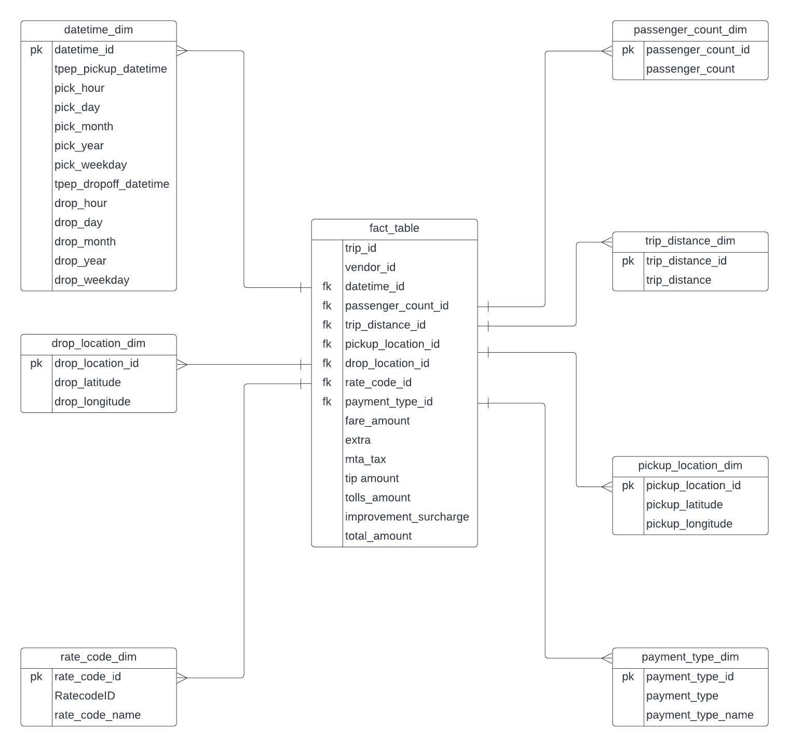

# Uber Data Analytics | Modern Data Engineering GCP Project

## Overview

This ambitious project aims to unlock valuable insights from Uber data through the power of cutting-edge tools and technologies, including Google Cloud Platform (GCP), Python, Compute Instance, Mage Data Pipeline Tool, BigQuery, and Looker Studio.

## System Architecture 

## Technology Used
- Programming Language: Python

- Google Cloud Platform:
1. Google Storage
2. Compute Instance 
3. BigQuery
4. Looker Studio

Modern Data Pipeine Tool: Mage AI(https://www.mage.ai/)

## Dataset Used
The project utilizes the TLC Trip Record Data, which consists of yellow and green taxi trip records. These records include information such as pick-up and drop-off dates/times, locations, trip distances, fares, rate types, payment types, and passenger counts reported by the driver.

More info about dataset can be found here:
1. Website - https://www.nyc.gov/site/tlc/about/tlc-trip-record-data.page
2. Data Dictionary - https://www.nyc.gov/assets/tlc/downloads/pdf/data_dictionary_trip_records_yellow.pdf

## Data Model

## Shoutouts 
I give a huge thanks to Darshil Parmar(https://www.youtube.com/@DarshilParmar) and his help during this project